# 🍔 Food Delivery App - Premium Flutter Project

A fully featured, production-ready Food Delivery Application built with **Flutter**. This project demonstrates a scalable architecture, modern UI/UX design, and complex state management using **Provider**.

It is designed to be a starting point or a reference for building professional-grade delivery apps, featuring everything from authentication to order tracking.

---

## 📑 Table of Contents
- [Features Overview](#-features-overview)
- [Project Structure](#-project-structure)
- [Architecture & Tech Stack](#-architecture--tech-stack)
- [Module Breakdown](#-module-breakdown)
- [Screenshots Gallery](#-screenshots-gallery)
- [Installation & Setup](#-installation--setup)

---

## 📱 Features Overview

### 🔐 Authentication & Onboarding
- **Secure Login/Signup**: Complete flow with proper validation.
- **Onboarding**: Smooth welcome screens introducing the app features.
- **Forgot Password**: Recovery flow for users.

### 🏠 Home & Discovery
- **Cuisine Filtering**: Browse by Italian, Mexican, Asian, etc., using smart asset mapping.
- **Smart Search**: Real-time filtering of restaurants and foods.
- **Popular Feeds**: Curated lists of top-rated food items.
- **Location Awareness**: Auto-detects and displays user delivery address.

### 🍱 Product Experience
- **Detailed Food Views**: High-quality images (supporting both Network & Asset), ingredient lists, and prep time.
- **Review System**: Users can rate and review dishes with star ratings.
- **Dynamic Pricing**: Price calculation based on prep type/size (simulated).

### 🛒 Cart & Checkout
- **State-Managed Cart**: Persistent cart state across the app.
- **Address Management**: Delivery address selection/editing.
- **Payment Methods**: UI for selecting payment options.
- **Checkout Process**: Step-by-step order confirmation.

### 📦 Order Management
- **Live Tracking**: Visual timeline of order status (Preparing -> On the Way -> Delivered).
- **Order History**: Access past orders.
- **Notifications**: Updates on order changes.

---

## 🏗 Project Structure

The project follows a **Feature-First Architecture**, keeping code modular and maintainable.

```
lib/
├── core/                   # Global functionality
│   ├── constants/          # App-wide constants (colors, assets, strings)
│   ├── theme/              # Theme data (Light/Dark mode configs)
│   ├── utils/              # Helper functions and validators
│   └── widgets/            # Reusable common widgets (Buttons, Inputs)
│
├── features/               # Feature modules
│   ├── authentication/     # Login, Signup, Auth Logic
│   ├── main_shell/         # Bottom Navigation Holder
│   ├── food/               # Core Food Logic (Menu, Details, Reviews)
│   │   ├── models/         # Data Models (Food, Restaurant, Review)
│   │   ├── providers/      # State Management (RestaurantProvider, FoodProvider)
│   │   ├── screens/        # UI Pages (Home, Details, List)
│   │   ├── services/       # API Calls (Mocked or Real HTTP)
│   │   └── widgets/        # Feature-specific widgets (Cards)
│   ├── cart/               # Cart Management
│   ├── favorites/          # Wishlist Logic 
│   ├── orders/             # Order History & Tracking
│   ├── profile/            # User Profile & Settings
│   ├── location/           # Geolocation & Mapping
│   ├── notifications/      # In-app alerts
│   └── welcome/            # Onboarding Screen
│
└── main.dart               # App Entry Point & Provider Injection
```

---

## 🛠 Architecture & Tech Stack

### Technology
-   **Framework**: [Flutter](https://flutter.dev/) (SDK > 3.10.1)
-   **Language**: Dart 3.0+

### State Management
-   **Provider**: Used for efficient state management. The app uses `MultiProvider` at the root (`main.dart`) to inject services like `RestaurantProvider`, `CartProvider`, `AuthProvider` globally. This ensures data availability throughout the widget tree.

### Key Packages
-   **`animate_do`**: For beautiful entrance animations.
-   **`shared_preferences`**: Local storage for user sessions and favorites.
-   **`google_fonts`**: Modern typography.
-   **`http`**: API communication.
-   **`geolocator` & `geocoding`**: Location services.

---

## 📖 Module Breakdown

### 1. The Core Layer (`lib/core`)
Contains the building blocks of the UI. `AppConstants` defines the Color Palette (Primary Modern Coral `#FF4757`) and asset mappings to ensure consistent branding.

### 2. Food Module (`lib/features/food`)
This is the heart of the app.
-   **Controllers**: `FoodProvider` manages the logic of fetching data and handling logic like "Popular Foods".
-   **Hybrid Image System**: Logic was implemented to support **both** specific network images for food items (for variety) and high-quality local assets for generic categories (for consistency).

### 3. Cart & Orders (`lib/features/cart`)
-   Cart logic is fully decoupled. Adding an item to the cart updates the counter in the generic `MainShell` instantly via Listeners.

---

## 📸 Screenshots Gallery

### 🌍 Discovery & Home
| Home Dashboard | Category Browsing | Restaurant View |
|:---:|:---:|:---:|
| 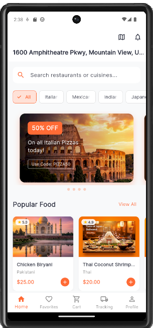 | 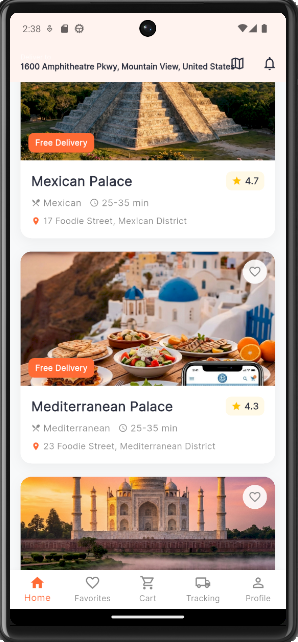 | 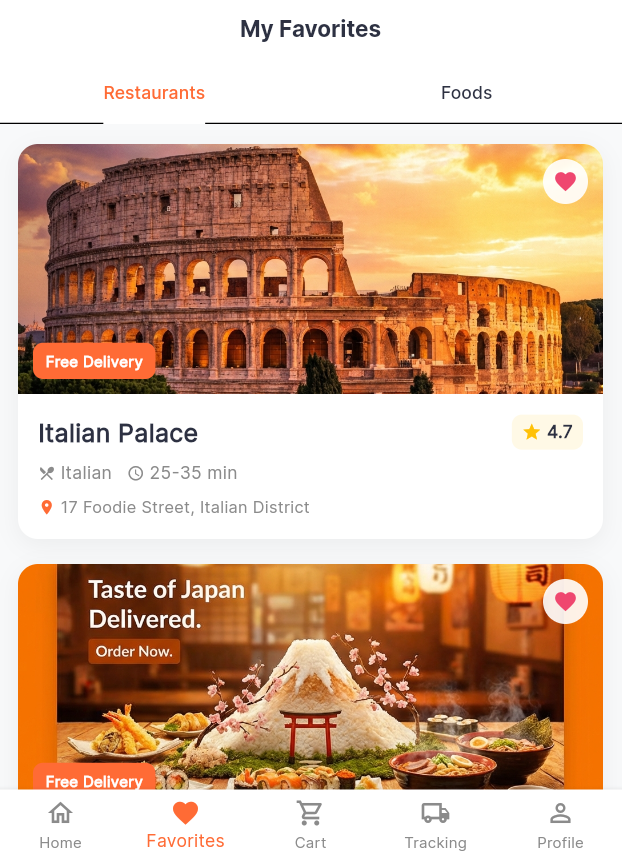 |
| *Immersive Home Screen* | *Scrollable Feeds* | *Restaurant Menu* |

### 🍔 Product & Ordering
| Product Details | Shopping Cart | Checkout Flow |
|:---:|:---:|:---:|
| 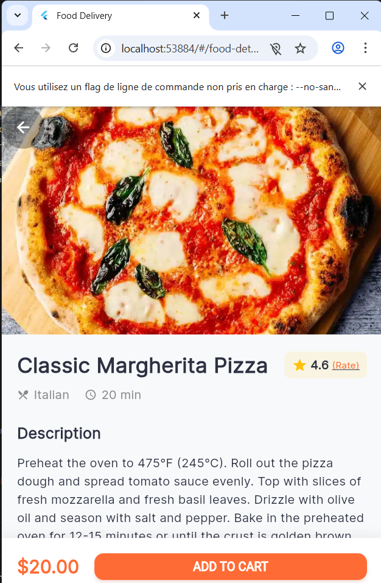 | 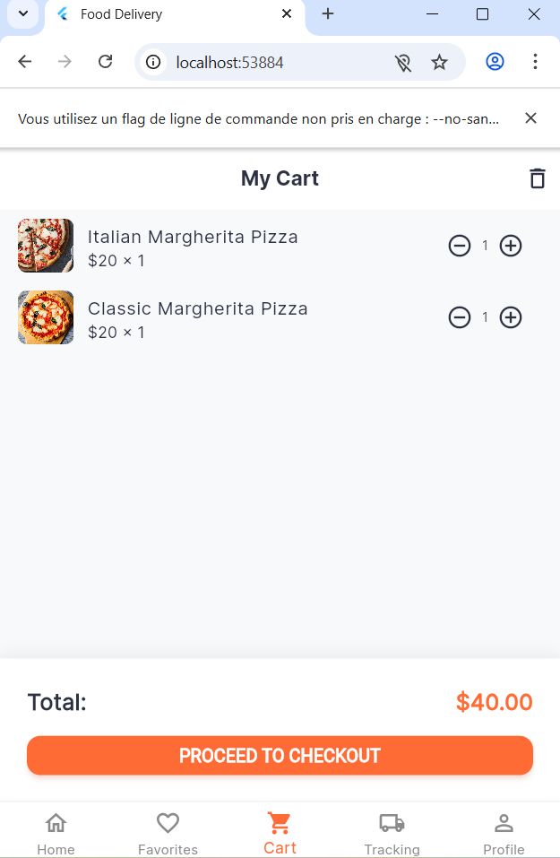 | 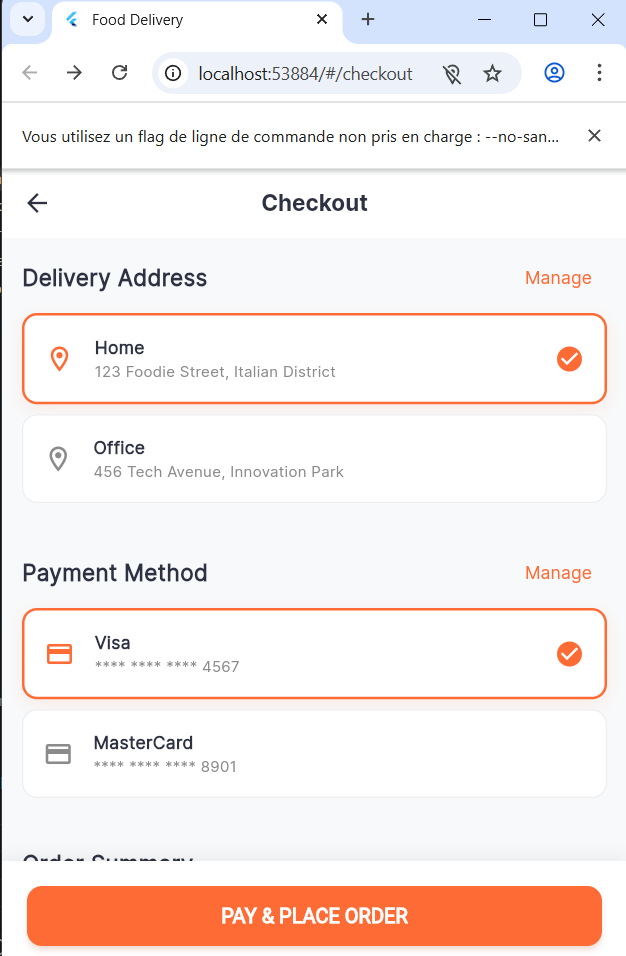 |
| *Rich Food info & Reviews* | *Cart Management* | *Secure Checkout* |

### 👤 User Features
| Favorites & Wishlist | Live Tracking | Profile Settings |
|:---:|:---:|:---:|
| 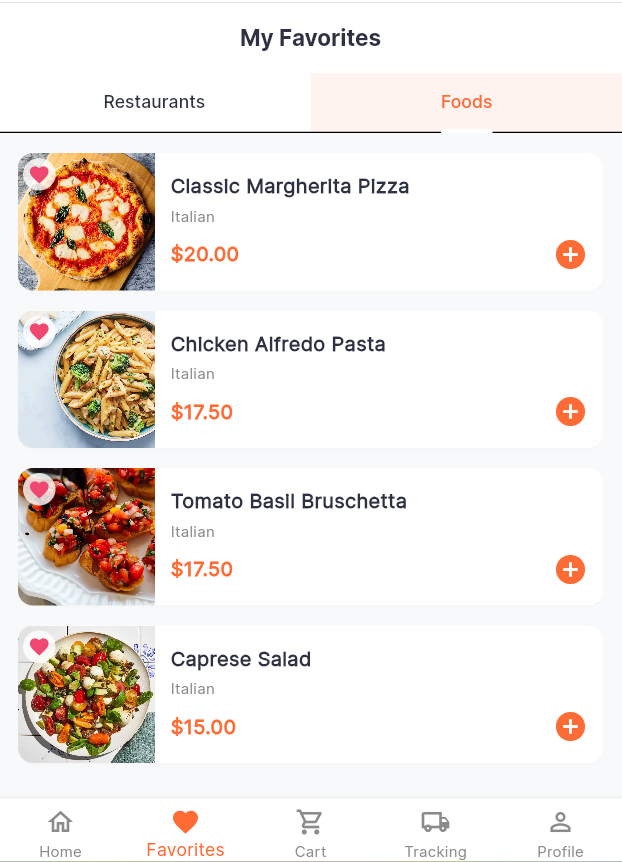 | 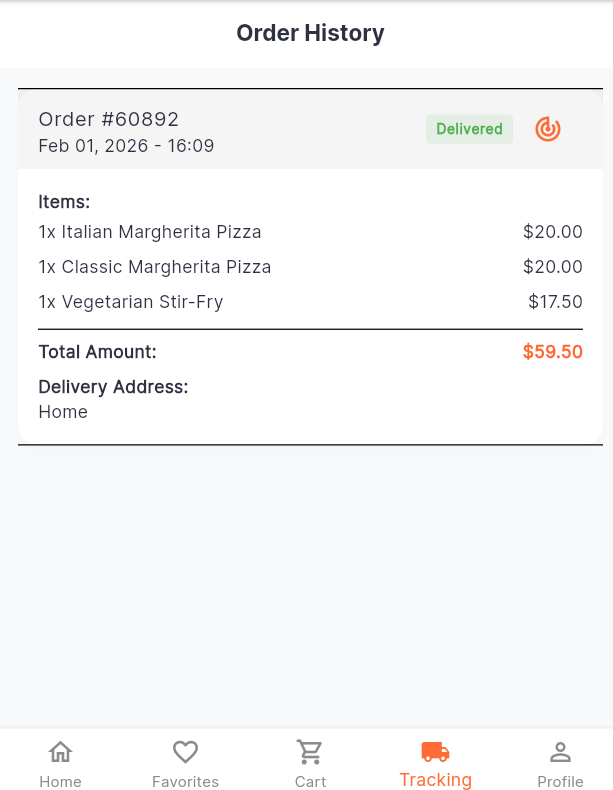 | 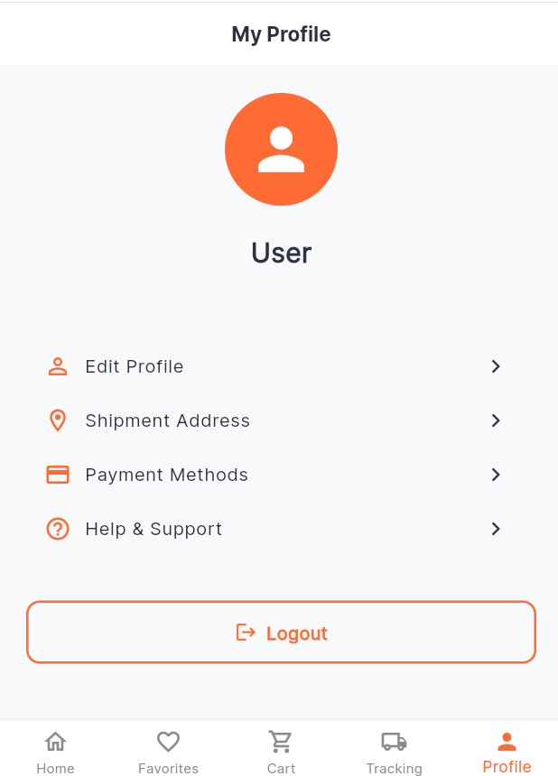 |
| *Saved Items* | *Order Status Timeline* | *User Management* |

### 📍 Maps & Alerts
| Location View | Activity Center | Order Complete |
|:---:|:---:|:---:|
| 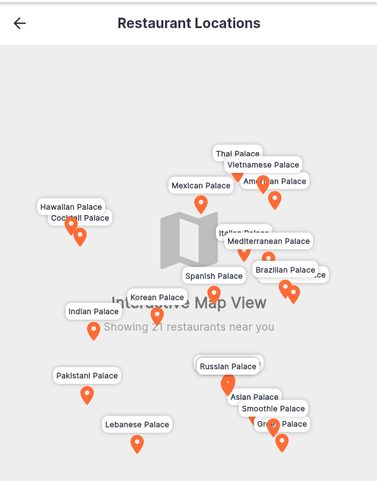 | 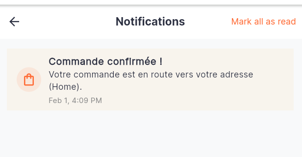 | 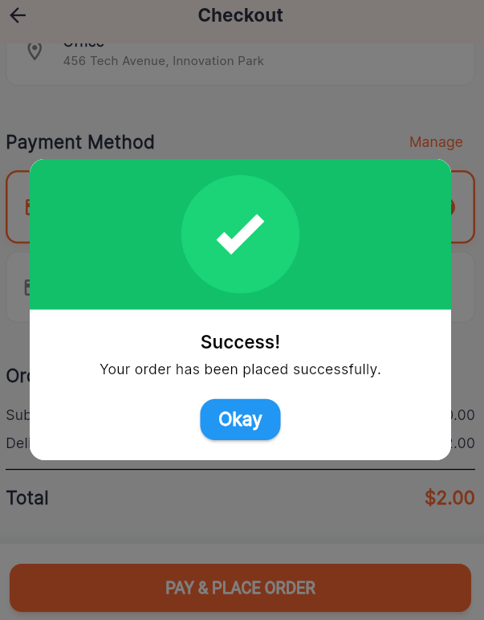 |
| *Restaurant Location* | *Notification System* | *Success Feedback* |

---

## 🚀 Installation & Setup

1.  **Prerequisites**: Ensure you have Flutter installed (`flutter doctor`).
2.  **Clone the Repo**:
    ```bash
    git clone https://github.com/your-repo/food_delivery.git
    cd food_delivery
    ```
3.  **Install Dependencies**:
    ```bash
    flutter pub get
    ```
4.  **Run the App**:
    *   **Mobile**: `flutter run` (Connect a device or emulator)
    *   **Web**:
        ```bash
        # IMPORTANT: Run clean first if you have asset issues
        flutter clean
        flutter run -d chrome
        ```
